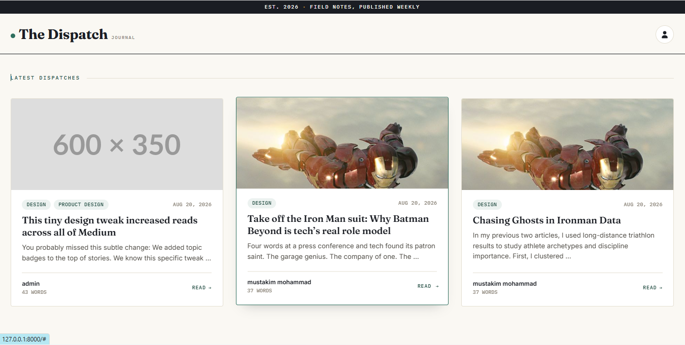

# The Dispatch Journal

A modern and responsive blog application built with Django. **The Dispatch Journal** allows users to create, manage, and explore blog posts through a clean editorial-style interface.

## 📸 Screenshot



## 🌐 Live Demo

🔗 [Visit The Dispatch Journal](https://your-live-link.com)

> Replace `https://your-live-link.com` with your actual deployed website link.

---

## ✨ Features

* 🔐 User registration and authentication
* 🔑 Login and logout functionality
* 👤 User dashboard
* 📝 Create new blog posts
* ✏️ Edit existing posts
* 🗑️ Delete posts
* 🖼️ Upload images with blog posts
* 🏷️ Add multiple categories to posts
* 📱 Responsive design
* 👨‍💻 Author information
* 📅 Publication date
* 🔔 Django messages and notifications
* 🎨 Clean editorial-style user interface

---

## 🛠️ Technologies Used

* Python
* Django
* HTML5
* CSS3
* Bootstrap 5
* Font Awesome
* Google Fonts
* SQLite

---

## 🚀 Installation

### 1. Clone the repository

```bash
git clone https://github.com/your-username/the-dispatch-blog.git
```

### 2. Navigate to the project directory

```bash
cd the-dispatch-blog
```

### 3. Create a virtual environment

```bash
python -m venv venv
```

### 4. Activate the virtual environment

**Windows:**

```bash
venv\Scripts\activate
```

**Mac/Linux:**

```bash
source venv/bin/activate
```

### 5. Install dependencies

```bash
pip install -r requirements.txt
```

### 6. Apply migrations

```bash
python manage.py migrate
```

### 7. Run the development server

```bash
python manage.py runserver
```

Then open:

```text
http://127.0.0.1:8000/
```

---

## 📂 Project Structure

```text
the-dispatch-blog/
│
├── app/
│   ├── migrations/
│   ├── templates/
│   ├── static/
│   ├── models.py
│   ├── views.py
│   ├── forms.py
│   └── urls.py
│
├── media/
│   └── post_images/
│
├── screenshots/
│   ├── home.png
│   ├── dashboard.png
│   └── add-post.png
│
├── project/
│   ├── settings.py
│   ├── urls.py
│   └── wsgi.py
│
├── manage.py
├── requirements.txt
└── README.md
```

---

## 🖼️ More Screenshots

### Home Page


### Dashboard


### Add Post


---

## 🔮 Future Improvements

* Post detail page
* Comments and replies
* Search functionality
* Pagination
* User profile image
* Like and bookmark system
* Rich text editor
* Dark mode

---

## 👨‍💻 Author

**Ekthiar Uddin**

GitHub: [@your-github-username](https://github.com/your-github-username)

---

## 📄 License

This project was created for educational and learning purposes.

---

⭐ If you like this project, consider giving it a star on GitHub!
